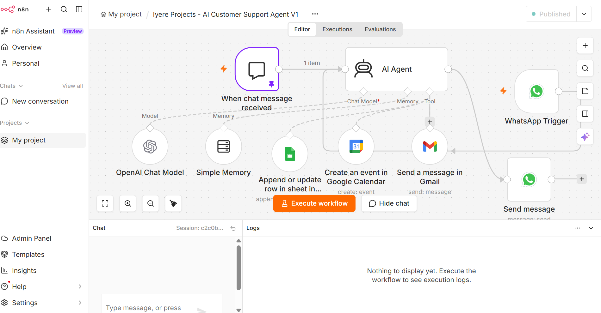
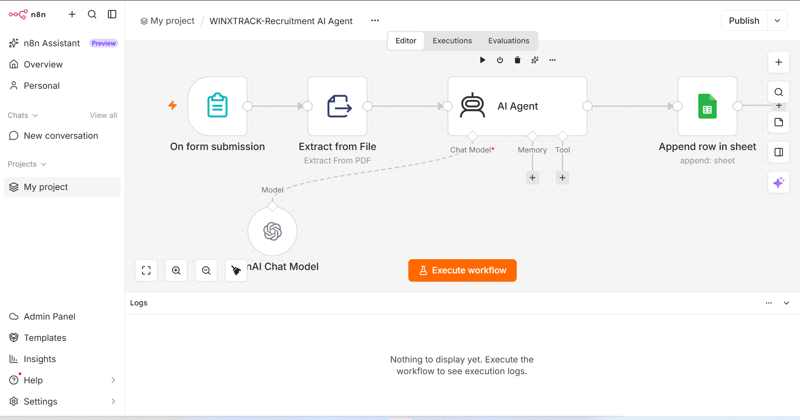

# Steven Iyere — AI Automation Portfolio

Business-focused AI automation and n8n workflow projects designed to reduce manual work, improve customer and candidate experiences, and connect everyday business tools.

## About Me

I build practical AI-assisted workflows for business operations, recruitment, lead management, customer intake, sales and digital production. My work combines **n8n**, AI tools, Google Workspace, CRM-style processes and API integrations to turn repetitive processes into structured workflows.

This portfolio documents selected projects and the problems they were designed to solve. Sensitive credentials, private customer information and production secrets are intentionally excluded.

## Featured Projects

### 1. Iyere Projects — Lead & CRM Automation
A lead-management workflow for an interior architecture and finishing business.

**Workflow:** Lead form → n8n → Google Sheets → AI-assisted processing → calendar/communication steps

**Highlights**
- Structured lead capture and centralized records
- Automated workflow orchestration with n8n
- Calendar event creation for follow-up
- AI-agent experimentation for lead handling
- WhatsApp/API integration work

[View case study](projects/iyere-projects.md)

### Workflow Preview

### 2. Winxtrack — Recruitment AI Agent
A recruitment workflow designed to collect candidate applications and CVs, organize candidate data and support AI-assisted qualification.

**Workflow:** Candidate form + CV → n8n → Google Sheets → email notification → AI qualification

**Highlights**
- Structured candidate intake
- CV/document capture
- Recruitment database mapping
- Automated email routing
- AI-assisted candidate screening workflow

[View case study](projects/winxtrack-recruitment.md)

### Workflow Preview

### 3. Kachi & Reuben — Fashion Sales & Order Automation
A customer order and CRM-style workflow for a men's fashion brand.

**Workflow:** Product/order form → n8n → Google Sheets → Gmail → planned calendar/WhatsApp extensions

**Highlights**
- Product and order intake
- Customer contact and delivery information capture
- Order ID and status-ready data structure
- Automated email workflow
- Foundation for WhatsApp and marketing automation

[View case study](projects/kachi-reuben.md)

### Workflow Preview

### 4. AI-Assisted Digital Production & Localization
International digital-production experience involving structured audio/localization workflows, synchronization, quality control and troubleshooting.

[View case study](projects/ai-digital-production.md)

## Core Skills

- n8n workflow automation
- AI agents and prompt engineering
- Business process automation
- Google Sheets and Gmail integrations
- Form and CRM workflow design
- Recruitment automation
- Customer/order intake automation
- API and webhook concepts
- Workflow testing and troubleshooting
- AI-assisted content and digital production

## Tools

n8n • ChatGPT • Claude • Gemini • Google Sheets • Gmail • Google Calendar • Canva • Photoshop • CapCut • Notion • Trello • Slack

## What I Focus On

I approach automation from the business problem first: identify repetitive work, define the data that needs to move, map the decision points, connect the right tools, test the workflow and make the process easier for the people using it.

---
**Location:** Lagos, Nigeria  
**Open to:** Global remote AI automation, AI operations, workflow, content and evaluation opportunities
